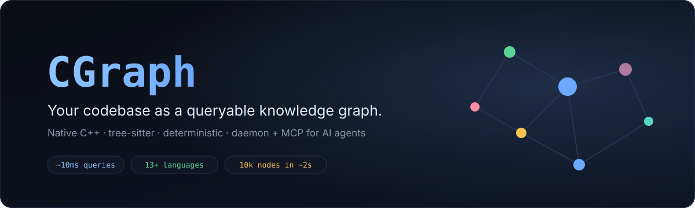
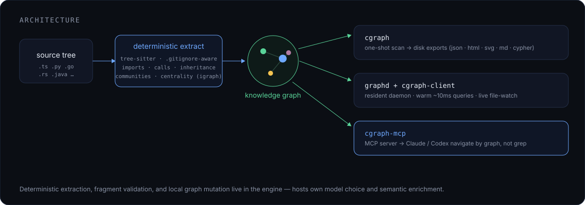
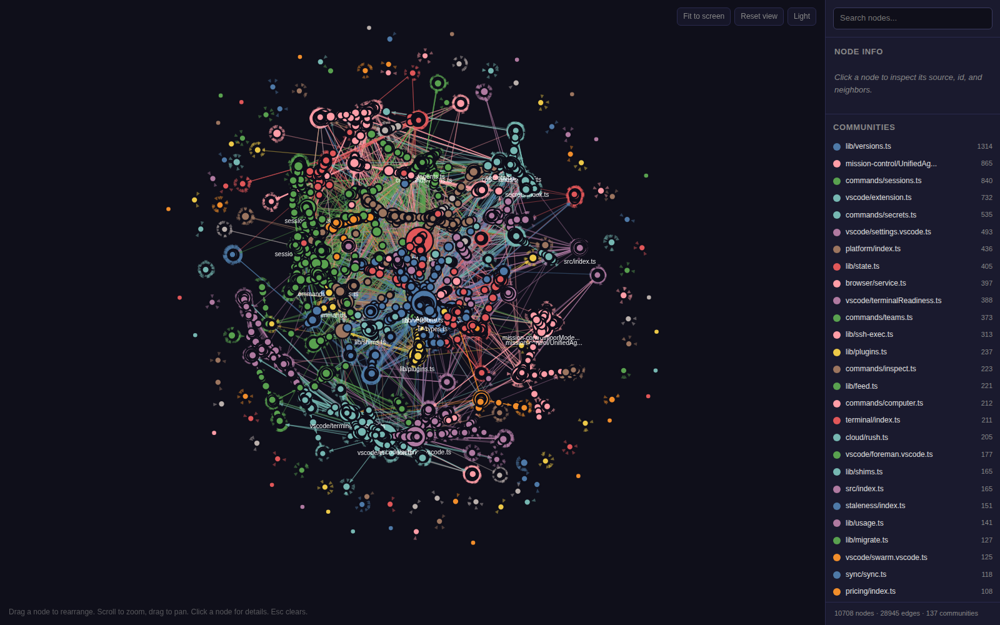
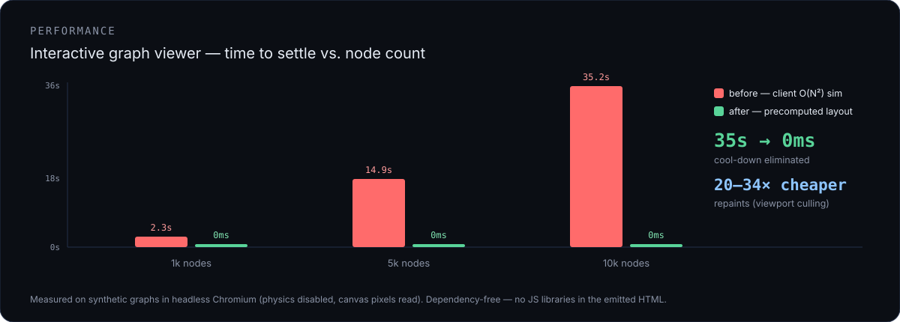

<div align="center">



**English** · [简体中文](README.zh-CN.md)

[](LICENSE)
[](CMakeLists.txt)
[](CMakePresets.json)
[](https://modelcontextprotocol.io)
[](#contributing)

*Scan a project · extract structure into a deterministic graph · query it in ~10 ms from a daemon, a thin client, or an MCP server.*

</div>

## Contents

[Why CGraph?](#why-cgraph) ·
[Architecture](#architecture) ·
[Repository layout](#repository-layout) ·
[What it produces](#what-it-produces) ·
[Output formats](#output-formats) ·
[Performance](#performance) ·
[Languages](#languages) ·
[Quick start](#quick-start) ·
[Install & Setup](#install--setup) ·
[Use with coding agents](#use-with-coding-agents) ·
[CLI · daemon · MCP reference](#cli-daemon-and-mcp-reference) ·
[Host integrations & enrichment](#host-integrations-and-enrichment) ·
[Development notes](#development-notes) ·
[Contributing](#contributing) ·
[License](#license)

## Why CGraph?

Reading a large repo to answer **"what calls this?"** or **"what breaks if I change it?"** means loading dozens of files — and those answers aren't in any single file. They live in the *relationships between* files. CGraph precomputes them so you (and your AI agent) navigate by **graph, not grep**.

| | |
| --- | --- |
| 🔗 **Reverse dependencies & blast radius** | `graph_impact` returns every transitive dependent of a symbol in ~10 ms. On a real 10,706-node repo it surfaced **93 dependents** of one god-file, instantly — an answer grep can't give you. |
| 🧭 **Navigate, don't grep** | Centrality-ranked search, node neighborhoods, shortest paths, and **token-budgeted source bundles** — served warm in ~10 ms instead of many file reads that burn context. |
| 🏛️ **Architecture at a glance** | Centrality ranking surfaces the load-bearing files; Leiden/Louvain community detection clusters the repo into modules automatically. |
| ⚡ **Deterministic & fast** | A full **10k-node graph builds in ~2 s**; no LLM in the extraction path — same input, same graph, every time. |
| 🤖 **Built for coding agents** | A standard **MCP** server drops the graph straight into Claude / Codex, so they reason over structure instead of blindly reading files. |

> **The pitch in one line:** for a codebase too big to hold in your head, CGraph is the index that decides *which* code to read — `ctags`/"find all references", precomputed, centrality-ranked, and exposed over MCP.

## Architecture

<div align="center"></div>

- **`cgraph`** — one-shot scan → portable disk exports (`graph.json`, `graph.html`, `graph.svg`, `obsidian.md`, `cypher.txt`, `call-flow.html`).
- **`graphd` + `cgraph-client`** — a resident per-project daemon with live file-watching; warm `query` / `path` / `explain` / `impact` / `context` in ~10 ms.
- **`cgraph-mcp`** — a Model Context Protocol server so agents navigate the graph directly.

The engine owns deterministic extraction, fragment validation, cache state, and local graph mutation; hosts own model choice and semantic enrichment.

## Repository layout

```text
src/cli/          One-shot CLI entrypoint: cgraph
src/daemon/       Daemon entrypoint: graphd
src/client/       Thin client runtime and cgraph-client executable
src/mcp/          MCP request handling and cgraph-mcp executable
src/engine/       Detection, extraction, graph building, analysis, daemon ops
tests/smoke/      CTest smoke coverage for engine, daemon, MCP, and integration paths
tests/fuzz/       Optional libFuzzer targets
integrations/     Host hook and always-on integration scripts
docs/             Host integration contract and benchmark notes
vendor/           Vendored tree-sitter core and grammars
```

## What it produces

A single scan turns a source tree into an interactive, explorable graph — communities colored, hubs sized by centrality:

<div align="center"></div>

<sub>The real `graph.html` viewer on a 10,708-node / 28,945-edge codebase — self-contained HTML, no external JS.</sub>

## Output formats

- `graph.json` — directed node-link JSON with graph metadata, nodes, and links
- `graph.html` — browser-readable interactive graph view
- `graph.svg` — static graph visualization
- `obsidian.md` — markdown export for Obsidian-style navigation
- `cypher.txt` — Neo4j Cypher statements
- `call-flow.html` — browser-readable call-flow view

## Performance

The interactive viewer used to run an O(N²) force simulation in the browser on every open. Layout is now **precomputed once in C++** (via igraph), and repaints are viewport-culled — both **dependency-free**:

<div align="center"></div>

| graph | time-to-settle **before** | **after** | per-frame repaint |
| --- | --- | --- | --- |
| 10,000 nodes | **35.2 s** (main thread pinned) | **~0 ms** (static layout) | **20–34× cheaper** (zoom/pan) |

## Languages

Tree-sitter-backed structural extraction, with regex/structured extraction for a few config formats:

<p>


</p>

Plus structured/regex extraction for Apex, Delphi form/source, MSBuild/XML project files, and MCP config files.

### Type members

Seven languages emit a `field` node per declared member, with a `defines` edge from the owner:

| Language | Owners with members | Field properties |
| --- | --- | --- |
| C, C++ | `class`, `struct` only — not `enum` or `union` | none |
| TypeScript, TSX | interface, object type alias, class (constructor parameter properties included), enum | `type_text`, `optional`, `readonly` |
| Go | struct, including multi-name and embedded fields | `type_text` |
| Rust | named and tuple struct, union, enum variant, trait associated type and constant | `type_text` |
| Python | class-body assignment, including chained and tuple targets | `type_text` when annotated |
| Java | class, record, enum | `type_text`, `readonly` |

Members are declared members only: no inherited-member expansion, no alias flattening, no runtime
attribute inference. A declaration that is already a node of its own — a TypeScript
`method_signature`, a Rust trait method or type alias — keeps its function or type node and is not
also a field. A field never takes the id a function or type holds; it moves instead, so a symbol's
id stays stable.

A class-like declaration without a body (`struct FileCacheEntry;`) is a forward declaration and mints
no node; only the body-bearing definition does.

Fields are members, not navigation targets: `graph_context` packs the owner (whose snippet spans its
members) rather than the members, and `report modules` symbol counts exclude them.

## Quick start

Download the current Linux x64 release and build your first graph:

```sh
mkdir -p "$HOME/.local/lib/cgraph/bin-v0.3.0" "$HOME/.local/bin"
curl -fL https://github.com/Nxtsoft/CGraph/releases/download/bin-v0.3.0/cgraph-linux-x64.tar.gz \
  -o "$HOME/.local/lib/cgraph/bin-v0.3.0/cgraph.tar.gz"
tar -xzf "$HOME/.local/lib/cgraph/bin-v0.3.0/cgraph.tar.gz" \
  -C "$HOME/.local/lib/cgraph/bin-v0.3.0"
for name in cgraph graphd cgraph-client cgraph-mcp; do
  ln -sf "$HOME/.local/lib/cgraph/bin-v0.3.0/$name" "$HOME/.local/bin/$name"
done
export PATH="$HOME/.local/bin:$PATH"

# Run this from any source repository.
cgraph --root . --out cgraph-out
```

Open `cgraph-out/graph.html` in a browser (`open cgraph-out/graph.html` on macOS), then [register CGraph with your coding agent](#use-with-coding-agents). See [Install & Setup](#install--setup) for other architectures and source builds.

## Install & Setup

Release `bin-v0.3.0` provides all four executables (`cgraph`, `graphd`, `cgraph-client`, and `cgraph-mcp`) in each archive:

| Platform | Architecture | Archive |
| --- | --- | --- |
| Linux | x86_64 / amd64 | [`cgraph-linux-x64.tar.gz`](https://github.com/Nxtsoft/CGraph/releases/download/bin-v0.3.0/cgraph-linux-x64.tar.gz) |
| Linux | arm64 / aarch64 | [`cgraph-linux-arm64.tar.gz`](https://github.com/Nxtsoft/CGraph/releases/download/bin-v0.3.0/cgraph-linux-arm64.tar.gz) |
| macOS | Apple silicon / arm64 | [`cgraph-macos-arm64.tar.gz`](https://github.com/Nxtsoft/CGraph/releases/download/bin-v0.3.0/cgraph-macos-arm64.tar.gz) |

Use `uname -s` and `uname -m` to select the archive. The quick start installs versioned files under `~/.local/lib/cgraph/bin-v0.3.0` and puts stable symlinks in `~/.local/bin`; add that directory to your `PATH` if needed. MCP client configs should use the absolute versioned path, because clients may not inherit your shell's `PATH`.

### Build from source

<details>
<summary><strong>Full build recipe — prerequisites · vcpkg · PATH · sanitizer &amp; fuzzer presets</strong></summary>

### Prerequisites

- CMake 3.25 or newer
- Ninja
- A C++20 compiler (recent Clang or GCC; Apple Clang from Xcode Command Line Tools works)
- A Fortran compiler (e.g. `gfortran`) — `igraph`'s vcpkg build pulls in `lapack-reference`, which needs one (`sudo apt-get install -y gfortran` / `brew install gcc`)
- Git
- vcpkg (a local copy is fine — see step 2). `curl`, `igraph`, `nlohmann-json`, and `utf8proc` are declared in `vcpkg.json` and built on first configure. `tree-sitter` is vendored under `vendor/tree-sitter`.

### 1. Clone (with submodules)

```sh
git clone --recurse-submodules https://github.com/Nxtsoft/CGraph.git && cd CGraph
# already cloned without submodules?
git submodule update --init --recursive
```

### 2. Point CMake at vcpkg

```sh
git clone https://github.com/microsoft/vcpkg .vcpkg   # full depth — a shallow clone omits the pinned baseline
./.vcpkg/bootstrap-vcpkg.sh
export VCPKG_ROOT="$PWD/.vcpkg"
```

### 3. Configure, build, verify

```sh
cmake --preset release
cmake --build --preset release            # first build compiles vcpkg deps — several minutes
ctest --preset release                    # smoke suite
build/release/src/cli/cgraph --root . --out cgraph-out
```

Binaries land at `build/release/src/{cli/cgraph, daemon/graphd, client/cgraph-client, mcp/cgraph-mcp}`.

### 4. (Optional) Put binaries on PATH

```sh
mkdir -p ~/.local/bin
for b in cli/cgraph daemon/graphd client/cgraph-client mcp/cgraph-mcp; do
  ln -sf "$PWD/build/release/src/$b" ~/.local/bin/
done
```

> MCP client configs (below) should still use absolute paths to the binaries, since a client may not inherit your interactive shell's `PATH`.

### Development builds

```sh
cmake --preset default    && cmake --build --preset default    && ctest --preset default       # Debug, no -O
cmake --preset sanitizers && cmake --build --preset sanitizers && ctest --preset sanitizers  # ASan/UBSan
cmake --preset fuzzers    && cmake --build --preset fuzzers    && ctest --preset fuzzers      # libFuzzer
```

The fuzzer preset requires a Clang toolchain with the libFuzzer runtime; use an upstream LLVM/Clang toolchain if Apple Command Line Tools lack it.

</details>

## Use with coding agents

`cgraph-mcp` is a standard [MCP](https://modelcontextprotocol.io) server over stdio (protocol `2024-11-05`). Register it once and your agent navigates the codebase through fast graph queries instead of blind grep/read:

| Tool | Purpose |
| --- | --- |
| `graph_query` | Search nodes by text; ranked by centrality |
| `graph_explain` | A node's neighborhood (callers, callees, imports) |
| `graph_impact` | Transitive blast radius of changing a node |
| `graph_path` | Shortest path between two nodes |
| `graph_context` | Token-budgeted source bundle for a node/query (with adaptive gather) |
| `graph_report` | Module dependency map (`view: "modules"`): layers, cycles, import/call counts, sized to a budget |
| `graph_update` | Content-verified sync; returns a `content_root` to pin reads |
| `graph_status` | Daemon, graph, and enrichment status |
| `graph_remember` / `graph_recall` | Session memory — checkpoint before `/compact`, recall after |
| `graph_shutdown` | Stop the daemon |

`graph_context` has two gather modes. The default (`gather: "fixed"`) packs the whole k-hop neighborhood. With a task query in hand, `gather: "adaptive"` keeps the full 2-hop core but expands the third hop only along query-relevant nodes — on the retrieval eval it lifted grade-2 recall **+0.057** for **+13%** candidate tokens, versus the **+96%** a full 3-hop gather costs (needs a `query`/`q`).

The server resolves the project root from `--root`, then `CLAUDE_PROJECT_DIR`, then the working directory, and finds `graphd` on its own (explicit `--daemon` wins, then `CGRAPH_DAEMON_PATH`, then a `graphd` next to `cgraph-mcp`). The first call triggers a one-time build (seconds); while it runs, results carry `"graph_state": "building"` so an empty result is never mistaken for "no match". Subsequent queries are warm (~10 ms). In the examples below, replace `/home/you` with your absolute home directory.

<details>
<summary><strong>🔌 Register with Claude Code · Codex · Cursor / Windsurf / other MCP clients</strong></summary>

### Claude Code

Claude Code sets `CLAUDE_PROJECT_DIR` per session, so a single registration works across every project:

```sh
claude mcp add --scope user --transport stdio cgraph \
  -- /home/you/.local/lib/cgraph/bin-v0.3.0/cgraph-mcp \
     --daemon /home/you/.local/lib/cgraph/bin-v0.3.0/graphd
```

Or commit a project-scoped `.mcp.json` at the repo root to share it with collaborators:

```json
{
  "mcpServers": {
    "cgraph": {
      "command": "/home/you/.local/lib/cgraph/bin-v0.3.0/cgraph-mcp",
      "args": ["--daemon", "/home/you/.local/lib/cgraph/bin-v0.3.0/graphd"]
    }
  }
}
```

Verify with `/mcp` inside Claude Code. This repo also ships host skills under `integrations/skills/` — `cgraph` (reach for the graph first on structure questions) and `cgraph-enrich` (the semantic-enrichment loop). Install with `cgraph skills install`; add the scheduled enrichment drainer (status-gated) with `cgraph drain install`.

### Codex CLI

Codex does not set `CLAUDE_PROJECT_DIR`, so the server falls back to the working directory Codex launches it from:

```sh
codex mcp add cgraph \
  -- /home/you/.local/lib/cgraph/bin-v0.3.0/cgraph-mcp \
     --daemon /home/you/.local/lib/cgraph/bin-v0.3.0/graphd
```

…or edit `~/.codex/config.toml` directly (add `"--root", "/abs/path/to/your/project"` to `args` to pin a project regardless of working directory):

```toml
[mcp_servers.cgraph]
command = "/home/you/.local/lib/cgraph/bin-v0.3.0/cgraph-mcp"
args = ["--daemon", "/home/you/.local/lib/cgraph/bin-v0.3.0/graphd"]
```

Restart Codex and run `/mcp` in the TUI to confirm.

### Cursor, Windsurf, and other MCP clients

Any MCP client that launches a stdio command works — add a server entry with the command and args (most use a `mcpServers` JSON block like Claude Code's `.mcp.json`). Set `--root` explicitly for clients that don't set `CLAUDE_PROJECT_DIR`. Smoke-test the server by hand:

```sh
printf '%s\n' '{"jsonrpc":"2.0","id":1,"method":"initialize","params":{}}' \
  | build/release/src/mcp/cgraph-mcp --root . \
      --daemon build/release/src/daemon/graphd
```

</details>

## CLI, daemon and MCP reference

<details>
<summary><strong>⌨️ CLI · 🛰️ daemon &amp; thin client · 🔌 MCP server internals</strong></summary>

### CLI

```sh
cgraph [--root PATH] [--out PATH]
cgraph enrich-plan [--root PATH] [--out PATH] [--drop DIR]
cgraph enrich-ingest [--root PATH] [--out PATH] [--drop DIR]
```

Defaults: `--root .`, `--out cgraph-out`, `--drop` → CGraph's semantic drop directory under the output path.

```sh
# Build deterministic exports.
build/release/src/cli/cgraph --root /path/to/project --out /tmp/cgraph-out
# Create a semantic chunk plan for host enrichment.
build/release/src/cli/cgraph enrich-plan --root /path/to/project --out /tmp/cgraph-out
# Ingest host-written chunk_NN.json fragments and re-export the graph.
build/release/src/cli/cgraph enrich-ingest --root /path/to/project --out /tmp/cgraph-out
```

### Reports

`cgraph report modules` draws the module dependency map of a project from the resident daemon
(spawned if absent): files grouped into modules by directory depth, `imports`/`CALLS` between
modules with counts, layers ranked by longest dependency path (layer 0 = nothing depends on it),
and every cycle listed. Test roots are excluded unless `--include-tests`.

```sh
cgraph report modules --root /path/to/project --scope src            # Mermaid `graph LR` on stdout
cgraph report modules --root /path/to/project --format json          # modules / edges / layers / cycles
cgraph report modules --root /path/to/project --format svg > modules.svg
cgraph report modules --root /path/to/project --depth 1 --budget 2000
```

The output is sized to a token budget (default 6000, `--budget 0` for all of it): when it
overflows, whole low-weight edges or modules are dropped and `omitted` says how many. One-shot
builds write the same diagram as `modules.mmd` and `modules.svg` next to `graph.json`. The same
report is the `graph_report` MCP tool and the daemon `report` op; views `design`, `clones`,
`types` are reserved and answer "not implemented".

### Daemon & thin client

```sh
build/release/src/daemon/graphd --root /path/to/project
```

The daemon watches the project tree while it runs: source edits fold into the graph incrementally within a couple of seconds (a large batch, e.g. a branch switch, collapses into one full rescan), and incremental state re-persists to `cgraph-out/` in the background and on shutdown. `--no-watch` disables this.

Optional daemon flags:

```sh
graphd --root PATH --idle-timeout SECONDS --no-watch
graphd --benchmark-query --graph PATH --query TEXT
graphd --version
```

Use the thin client (responses are JSON; `status` includes process metadata, node/edge counts, cache hit rate, and enrichment state):

```sh
build/release/src/client/cgraph-client --root /path/to/project status
build/release/src/client/cgraph-client --root /path/to/project query '{"q":"Parser"}'
build/release/src/client/cgraph-client --root /path/to/project explain '{"id":"Parser"}'
build/release/src/client/cgraph-client --root /path/to/project path '{"source":"A","target":"B"}'
build/release/src/client/cgraph-client --root /path/to/project report '{"view":"modules","format":"mermaid","scope":"src"}'
build/release/src/client/cgraph-client --root /path/to/project update '{"path":"."}'
build/release/src/client/cgraph-client --root /path/to/project shutdown
```

### MCP server

`cgraph-mcp` speaks MCP over stdio: newline-delimited JSON-RPC 2.0 implementing `initialize`, `tools/list`, `tools/call`, and `notifications/initialized` (protocol `2024-11-05`). Tool calls route through the same daemon operation handler used by the thin client; invalid JSON receives a JSON-RPC parse error. For registration and the tool list, see [Use with coding agents](#use-with-coding-agents).

</details>

## Host integrations and enrichment

<details>
<summary><strong>🧩 Host hook &amp; always-on loop · 🧠 semantic enrichment fragments</strong></summary>

### Host integrations

CGraph keeps provider and model concerns outside the native binary. Host integrations use `cgraph-client` for graph operations and dispatch semantic work through their own agent/model workflow. The reference hook accepts the deterministic daemon operations:

```sh
integrations/hooks/cgraph-hook.sh status
integrations/hooks/cgraph-hook.sh query '{"q":"GraphSnapshot"}'
```

Useful environment variables: `CGRAPH_CLIENT` (client executable), `CGRAPH_PROJECT_ROOT` (project root), `CGRAPH_DAEMON` (daemon path), `CGRAPH_INTERVAL_SECONDS` (always-on interval, default `30`), `CGRAPH_REFRESH_ON_START` (`0` to skip the initial update), `CGRAPH_ONCE` (`1` to run one status check and exit). Run the always-on reference loop:

```sh
CGRAPH_CLIENT=build/release/src/client/cgraph-client \
CGRAPH_PROJECT_ROOT=/path/to/project \
integrations/always-on/cgraph-always-on.sh
```

See `docs/host-skill-contract.md` for the full host contract.

### Semantic enrichment

A host-driven workflow: (1) CGraph emits a chunk plan for uncached or stale semantic inputs; (2) the host processes each chunk with its own model/agent; (3) the host writes exactly one `chunk_NN.json` fragment per completed chunk into the semantic drop directory; (4) CGraph validates each fragment before graph mutation; (5) valid fragments update the graph and semantic cache, malformed fragments are rejected without changing the snapshot.

Fragments use this node-link shape (required: node `id`/`label`; edge `source`/`target`/`relation`; hyperedge `id`/`nodes`/`relation`. Optional: `source_file`, `source_location`, `type`/`kind`, `confidence`, `confidence_score`, `properties`, `warnings`):

```json
{
  "nodes": [{ "id": "doc:architecture", "label": "Architecture", "kind": "document" }],
  "edges": [{ "source": "doc:architecture", "target": "component:engine", "relation": "describes" }],
  "hyperedges": []
}
```

</details>

## Development notes

- Keep extraction behavior deterministic in the engine. Provider-specific logic belongs in host integrations.
- Add smoke coverage under `tests/smoke/` for engine behavior and integration surfaces.
- Add fuzzer coverage under `tests/fuzz/` for parser or extractor hardening.
- Prefer extending the central language configuration and extractor pipeline over adding ad-hoc extraction logic in consumers.
- The interactive viewer is intentionally **dependency-free** — no JS libraries in the emitted HTML.

## Contributing

Issues and PRs welcome. Build with the `default` preset, keep `ctest --preset default` green, and prefer the `sanitizers` preset while iterating.

## License

[MIT](LICENSE).
