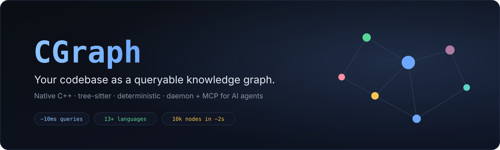
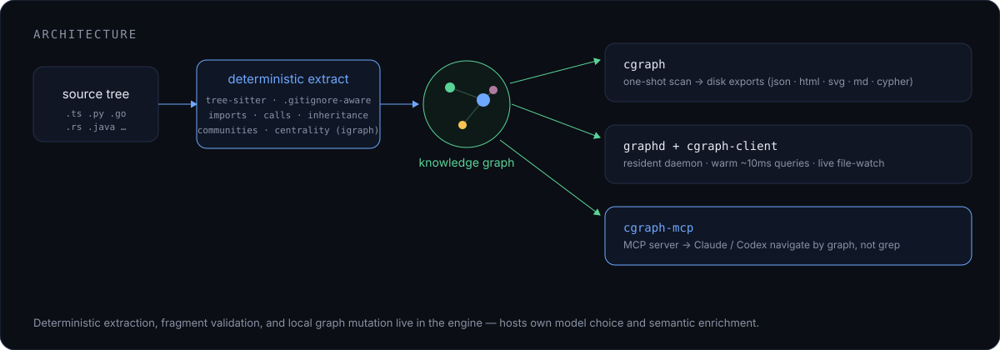
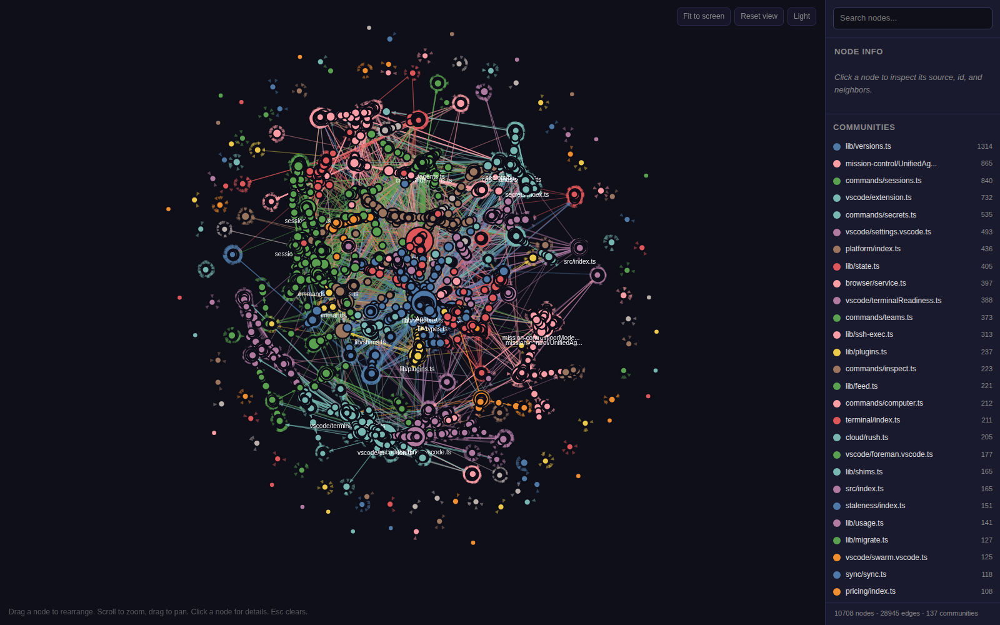
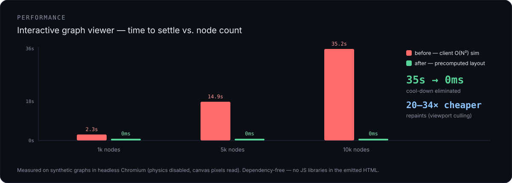

<div align="center">



**English** · [简体中文](README.zh-CN.md)

[](LICENSE)
[](CMakeLists.txt)
[](CMakePresets.json)
[](https://modelcontextprotocol.io)
[](#contributing)

*Scan a project · extract structure into a deterministic graph · query it in ~10 ms from a daemon, a thin client, or an MCP server.*

</div>

## Contents

[Why CGraph?](#why-cgraph) ·
[Architecture](#architecture) ·
[Repository layout](#repository-layout) ·
[What it produces](#what-it-produces) ·
[Output formats](#output-formats) ·
[Performance](#performance) ·
[Languages](#languages) ·
[Quick start](#quick-start) ·
[Install & Setup](#install--setup) ·
[Use with coding agents](#use-with-coding-agents) ·
[CLI · daemon · MCP reference](#cli-daemon-and-mcp-reference) ·
[Host integrations & enrichment](#host-integrations-and-enrichment) ·
[Development notes](#development-notes) ·
[Contributing](#contributing) ·
[License](#license)

## Why CGraph?

Reading a large repo to answer **"what calls this?"** or **"what breaks if I change it?"** means loading dozens of files — and those answers aren't in any single file. They live in the *relationships between* files. CGraph precomputes them so you (and your AI agent) navigate by **graph, not grep**.

| | |
| --- | --- |
| 🔗 **Reverse dependencies & blast radius** | `graph_impact` returns every transitive dependent of a symbol in ~10 ms. On a real 10,706-node repo it surfaced **93 dependents** of one god-file, instantly — an answer grep can't give you. |
| 🧭 **Navigate, don't grep** | Centrality-ranked search, node neighborhoods, shortest paths, and **token-budgeted source bundles** — served warm in ~10 ms instead of many file reads that burn context. |
| 🏛️ **Architecture at a glance** | Centrality ranking surfaces the load-bearing files; Leiden/Louvain community detection clusters the repo into modules automatically. |
| ⚡ **Deterministic & fast** | A full **10k-node graph builds in ~2 s**; no LLM in the extraction path — same input, same graph, every time. |
| 🤖 **Built for coding agents** | A standard **MCP** server drops the graph straight into Claude / Codex, so they reason over structure instead of blindly reading files. |

> **The pitch in one line:** for a codebase too big to hold in your head, CGraph is the index that decides *which* code to read — `ctags`/"find all references", precomputed, centrality-ranked, and exposed over MCP.

## Architecture

<div align="center"></div>

- **`cgraph`** — one-shot scan → portable disk exports (`graph.json`, `graph.html`, `graph.svg`, `obsidian.md`, `cypher.txt`, `modules.mmd`, `modules.svg`, `design.mmd`, `design.md`).
- **`graphd` + `cgraph-client`** — a resident per-project daemon with live file-watching; warm `query` / `path` / `explain` / `impact` / `context` in ~10 ms.
- **`cgraph-mcp`** — a Model Context Protocol server so agents navigate the graph directly.

The engine owns deterministic extraction, fragment validation, cache state, and local graph mutation; hosts own model choice and semantic enrichment.

## Repository layout

```text
src/cli/          One-shot CLI entrypoint: cgraph
src/daemon/       Daemon entrypoint: graphd
src/client/       Thin client runtime and cgraph-client executable
src/mcp/          MCP request handling and cgraph-mcp executable
src/engine/       Detection, extraction, graph building, analysis, daemon ops
tests/smoke/      CTest smoke coverage for engine, daemon, MCP, and integration paths
tests/fuzz/       Optional libFuzzer targets
integrations/     Host hook and always-on integration scripts
docs/             Host integration contract and benchmark notes
vendor/           Vendored tree-sitter core and grammars
```

## What it produces

A single scan turns a source tree into an interactive, explorable graph — communities colored, hubs sized by centrality:

<div align="center"></div>

<sub>The real `graph.html` viewer on a 10,708-node / 28,945-edge codebase — self-contained HTML, no external JS.</sub>

## Output formats

- `graph.json` — directed node-link JSON with graph metadata, nodes, and links. Node ids derive
  from each file's path relative to the project root, so the same commit built from two
  checkouts yields the same ids and two graphs can be joined by id; `source_file` stays the
  path the graph was read from
- `graph.html` — browser-readable interactive graph view
- `graph.svg` — static graph visualization
- `obsidian.md` — markdown export for Obsidian-style navigation
- `cypher.txt` — Neo4j Cypher statements
- `modules.mmd` — module dependency diagram as Mermaid
- `modules.svg` — module dependency diagram as a layered static image
- `design.mmd` — entry points and their top call flows as a Mermaid `flowchart TD`
- `design.md` — the same as Markdown: entry-point table, nested flows, layers by call distance

## Performance

The interactive viewer used to run an O(N²) force simulation in the browser on every open. Layout is now **precomputed once in C++** (via igraph), and repaints are viewport-culled — both **dependency-free**:

<div align="center"></div>

| graph | time-to-settle **before** | **after** | per-frame repaint |
| --- | --- | --- | --- |
| 10,000 nodes | **35.2 s** (main thread pinned) | **~0 ms** (static layout) | **20–34× cheaper** (zoom/pan) |

## Languages

Tree-sitter-backed structural extraction, with regex/structured extraction for a few config formats:

<p>


</p>

Plus structured/regex extraction for Apex, Delphi form/source, MSBuild/XML project files, and MCP config files.

### Type members

Seven languages emit a `field` node per declared member, with a `defines` edge from the owner:

| Language | Owners with members | Field properties |
| --- | --- | --- |
| C, C++ | `class`, `struct` only — not `enum` or `union` | none |
| TypeScript, TSX | interface, object type alias, class (constructor parameter properties included), enum | `type_text`, `optional`, `readonly` |
| Go | struct, including multi-name and embedded fields | `type_text` |
| Rust | named and tuple struct, union, enum variant, trait associated type and constant | `type_text` |
| Python | class-body assignment, including chained and tuple targets | `type_text` when annotated |
| Java | class, record, enum | `type_text`, `readonly` |

Members are declared members only: no inherited-member expansion, no alias flattening, no runtime
attribute inference. A declaration that is already a node of its own — a TypeScript
`method_signature`, a Rust trait method or type alias — keeps its function or type node and is not
also a field. A field never takes the id a function or type holds; it moves instead, so a symbol's
id stays stable.

A class-like declaration without a body (`struct FileCacheEntry;`) is a forward declaration and mints
no node; only the body-bearing definition does.

Fields are members, not navigation targets: `graph_context` packs the owner (whose snippet spans its
members) rather than the members, and `report modules` symbol counts exclude them.

### HTTP endpoints

JavaScript and TypeScript services get one `endpoint` node per route the code serves, with the
full path composed across files: an Elysia, Express or Hono chain's own prefix (`new Elysia({
prefix: '/notebooks' })`, `.basePath('/v1')`) beneath every `.use(child)`, `.use('/p', child)` or
`.route('/p', child)` that mounts it, up to the top-level chain, read through `as any` and
`as unknown as T` casts and resolved through imports (aliased ones included). A chain built inline
inside `.use(new Elysia({ prefix }).get(…))`, a `.group('/v2', app => app.get(…))` or `.guard()`
callback, and a module re-exported as `export const deckModule = deckRoutes as unknown as Elysia`
all compose the same way. A Next.js `app/api/x/[id]/route.ts` exporting `GET` is `GET /api/x/:id`.
A repository holding a `langgraph.json` with a non-empty `graphs` object is a LangGraph Agent
Server: its 49 framework routes (`POST /runs/wait`, `POST /threads/{thread_id}/runs/stream`,
`GET /assistants/{assistant_id}`, ..., the table `@langchain/langgraph-api` 1.5.1 registers, less its four `crons` routes, which answer 500 "Not implemented"; see
https://docs.langchain.com/langsmith/server-api-ref) are served endpoints handled by a
`langgraph_server` node spanning that object, with one `langgraph_graph` node per graph. A group
the config switches off (`http.disable_runs`, `disable_store`, ...) is not served.
Kotlin and Java Spring controllers get the same nodes: a method annotated `@GetMapping("/{id}")`
(or `@PostMapping`, `@PutMapping`, `@DeleteMapping`, `@PatchMapping`, or `@RequestMapping` with a
`method`) under a class-level `@RequestMapping("/api/v1/users")` is `GET /api/v1/users/{id}`.
Paths are read from string literals only (positional, `value =`, `path =`, or an array of them); a
path built from a constant, and a method-level `@RequestMapping` without `method`, are not minted.
A Spring Boot application whose `build.gradle(.kts)` or `pom.xml` applies the Boot plugin (not
`apply false`; Maven: the Boot parent, or the plugin outside `<pluginManagement>`, packaging not
`pom`) and depends on `spring-boot-starter-actuator` and a web starter serves the Actuator
endpoints its `src/main/resources/application[-profile].{yml,yaml,properties}` expose: `health`
by default, else `management.endpoints.web.exposure.include` less `exclude`, under
`management.endpoints.web.base-path` (default `/actuator`), with the discovery page, health
groups, per-endpoint access, and `prometheus` / `caches` only with the Prometheus registry / the
cache module. The liveness and readiness groups are on by default for Boot 4 (unless
`probes.enabled` is false) and only when it is true for Boot 3 or an unknown version. Where they
sit follows Boot's `ManagementPortType`: a negative `management.server.port` or
`spring.main.web-application-type: none` serves nothing; the same port puts them under the context
path; another port under `management.server.base-path`. The endpoints are the union over the base
config and each profile, handled by the `actuator_exposure` node at the `include` line that won
(or the build file's `spring_actuator` node when nothing sets it). Endpoints that need another bean
or dependency, profile expressions, placeholders without a default, and YAML anchors, aliases,
tags or flow mappings on the deciding keys are not modeled (those configurations serve nothing);
see `spring_actuator.hpp`.
Python FastAPI services get them too: a function decorated `@router.post("/{project_id}/setup")`
(or `.get`, `.put`, `.patch`, `.delete`, `.head`, `.options`, or `.api_route(path, methods=[...])`,
which defaults to GET) on a module-level `router = APIRouter(prefix="/project")` or `app =
FastAPI()` is `POST /project/{project_id}/setup` beneath every `include_router(router,
prefix="/v1")` or `app.mount("/v1", sub_app)` that mounts it, composed across files through
imports: `from api.routes.x import router as x_router` (the alias is the only name bound),
`from app.routers import users` then `include_router(users.router)` (a submodule), `import
app.routers.items as items` then `include_router(items.router)`, a router a package's
`__init__.py` imports and another file imports from the package, and each router of a
`for r in (users.router, items.router): app.include_router(r)` loop over a literal tuple or list.
A path, prefix or `methods` list that is not a plain string literal (an f-string that
interpolates, `prefix=settings.PREFIX`), a route or `include_router` inside a function (an app
factory), and an `include_router` on anything but a module-level router of its file
(`app = create_app()`, `app.router`, `self.app`, a router imported from another file) are not
minted and are counted in `routes_unresolved` / `mounts_unresolved`; a router whose every mount is
one of those mints nothing. A loop over anything else (`for r in ROUTERS:`) is counted unresolved
without identifying its routers. A router nothing mounts is served at its own prefix, as a
JavaScript router is. `add_api_route(...)` is not read, and a mount of a longer dotted name
(`include_router(api.v1.router)`) is counted unresolved without placing its router. Flask is not
read: `register_blueprint(url_prefix=)` replaces the blueprint's own prefix rather than composing
with it.
The node's id is `endpoint:GET /api/v1/notebooks/{}/notes` with no repository in it and `{}` for
every parameter segment (`:id`, `{id}`, `[id]`), its label keeps the provider's spelling
(`GET /api/v1/notebooks/:id/notes`), and it carries `method` and `path`, the handler's file and
span, a `contains` edge from that file and a `handled_by` edge to the handler, so `graph_impact`
on a handler reaches its endpoint. Chains mounted twice serve their routes twice; a route on a
router the file only receives as a function parameter (`function register(app) { app.get(…) }`)
is not minted, and `stats.json` counts it under `route_resolution.routes_unresolved`.

Database tables join the same walk. Every `CREATE TABLE` in a repo's `.sql` migrations is a
`sql_table` node, and a Drizzle model declared with a literal name (`export const competitors =
pgTable('competitors', …)`, likewise `mysqlTable` and `sqliteTable`) gets a `maps_table` edge to the
table of that name. A dependents walk that reaches a file through an import, or from a
module-level value it declares, also reaches the endpoints the file serves, so `graph_impact` on
`sql_table_competitors` goes table, model, the services importing it, their route files, and the
routes. A path through a function, class or endpoint does not serve routes, whether it climbs to
the function's own file or follows an import of the function (and on to the app file that mounts
the route file): a changed function reaches the routes it affects through the calls into their
handlers, not every route nearby. A seam `service` node is listed when reached but not walked
through, so one consumer edge into it does not pull in every endpoint of that service.

The callers are in the graph too. A `fetch(\`${API_URL}/api/v1/projects/${id}/publish\`, { method:
'POST' })`, an openapi-fetch `api.GET('/api/v1/projects/{id}', …)`, an `axios.post(…)`, and a call
through a path wrapper (`apiFetch(path)` whose own `fetch(\`${base}${path}\`)` appends a
parameter to a module constant) each give the calling function (or the module-level object the
arrow initialises) a `CONSUMES` edge to `endpoint:<METHOD> <canonical path>`. The host
interpolation is dropped (except a call that takes a runtime value, such as `${base(id)}/x`, a URL
builder that may hold part of the path, which leaves the request unresolved unless the builder is
a function of the same file, which is read), a whole-segment interpolation is `{}`, the method
comes from the call's literal `method` option, the wrapper's own, or the client verb, else GET.
What one file says for certain is read through: a URL held in a local (`const url = \`${BASE}/x\``,
`new URL(...)` then `url.toString()`, a `let` set per branch), a class field prefix
(`${this.API_BASE}/v1/...`), an axios instance's `baseURL` (`this.api.get('v1/users')` under
`baseURL: '/api/backend'`), a class-method wrapper (`this.patch(\`v1/users/${id}/enable\`)`), and a
wrapper whose path or method is a later parameter (`mlBackendRequest('POST', \`/project/${id}/setup\`)`,
a method parameter's default applying when a call leaves it out). When this repository
does not serve the route the node is minted with `served: false` and no source; when it does
(a Next.js route file fetched from the same app) the one node has both a handler and its callers.
A URL whose value the file cannot read, a method a call does not spell out, a relative path
(`v1/users`) with no base ending in `/` to join it to, or an absolute `https://` literal adds
nothing and is counted under `route_resolution.calls_unresolved`. Kotlin and Go clients consume the same way:
a Ktor `client.patch("$baseUrl/api/v1/sessions/$id/invalidate") { … }` on a receiver whose name
ends like a client (`client`, `httpClient`, `api`; not `clients` or `httpCache`), Go's
`http.Get(url)` and `http.NewRequest(method, url, body)`, and any Go call passing a context, then a
method (`http.MethodPost` or `"POST"`), then a path, such as `c.Do(ctx, http.MethodGet,
"/api/v1/auth/me", nil)`. A Go route registration (`r.Handle(http.MethodGet, "/x", h)`), a call
with a `func` literal argument, `httptest` and an assertion on `r.Method` carry no context or a
handler, and are no requests. The leading `$baseUrl` of a
Ktor URL is the host; a Go client method's path is relative to its own base, so a value in front
of it (`n.Base+"/import"`) leaves the call unresolved. A function whose request appends one of its
parameters (`postAuth(ctx, path, req)` calling `c.Do(ctx, http.MethodPost, path, body)`, or
`client.post("$baseUrl$path")`, also from inside a lambda such as `withContext(…) { … }`) is a wrapper, and a call to it in the same file with a path
literal (`c.postAuth(ctx, "/api/v1/auth/login", req)`, `postLoginOutcome(path = "/api/v1/…")`)
consumes the joined route. A Ktor `client.request(url) { method = … }` sets its verb in the
builder and is counted unresolved. Because the id carries no repository, two
graphs built separately share their endpoint nodes. `seam fuse` scopes every other node id by its service (`api::src_db_client_ts`), so two repositories with the same relative file stay two nodes:

```sh
cgraph seam discover --graph api=api-out/graph.json --graph web=web-out/graph.json --out seam-drop
cgraph seam fuse --seam seam-drop/chunk_00.json --graph api=api-out/graph.json --graph web=web-out/graph.json --out fused
```

`seam discover` writes the seam fragment from what each graph serves (`SERVED_BY`, `HANDLED_BY`),
consumes (`CONSUMES`, `CONSUMED_AT`) and documents (`DOCUMENTED_IN`) with no hand-written spec,
and reports how many endpoints matched across services, how many are consumed with no provider
among the graphs, and, when a graph carries a contract document, the **drift**: endpoints the
document promises that no service serves, and endpoints served that no document mentions.

A front end that reaches its backend through its own catch-all proxy (idp-front-end calls
`/api/backend/v1/users/{id}`; its `app/api/backend/[...path]/route.ts` forwards to
`${BACKEND_URL}/api/v1/users/{id}`) names that with `--prefix REPO:/from=/to` on both `seam discover`
and `seam fuse` (`--prefix web:/api/backend=/api`). An endpoint `web` consumes but does not serve,
under `/api/backend`, then joins the provider's `/api/...` endpoint; its `CONSUMED_AT` edge keeps
the consumer's own path as `via`, and the log counts the endpoints each prefix joined. A route the
front end serves itself (`/api/backend/healthz`) is never mapped, and a proxied path only the front
end serves is not joined. Each repository's own graph keeps its own spelling. The forwarding target
is not read from the proxy's code: it is built at run time from the handler's parameters, so it is
declared, not guessed.

Contracts other than endpoints are recorded by extractors as `provides_contract` /
`uses_contract` facts: `header:<name>` (case-folded), `claim:<name>`, `env:<NAME>`, and tables and
graph labels as `table:<database>:<name>` / `label:<database>:<name>`. They do not all join alike:

- **Claims and non-standard headers** (`x-tenant-id`) join like endpoints, by id. A standard HTTP
  header (`authorization`, `content-type`, any IANA permanent field name, `x-request-id`,
  `x-forwarded-*`, `traceparent`) never joins: every service uses those for its own reasons. Nor
  does a standard JWT claim, which any issuer writes with the same meaning (`iss`, `sub`, `exp`,
  `email`, `name`, `scope`, `client_id`: the IANA JWT Claims registry's RFC 7519, OpenID Connect,
  RFC 7800, RFC 8693 and RFC 9449 names); application claims (`roles`, `tenant_id`, `session_id`) do. A claim is recorded only where the code is provably about a JWT: `.claim("roles", r)`
  on a jjwt `Jwts.builder()` or Nimbus `JWTClaimsSet.Builder()` chain, the payload keys of
  `jsonwebtoken` `sign`, jose `SignJWT` and PyJWT `jwt.encode`; the `json:"x"` tags of a Go struct
  that embeds golang-jwt's `RegisteredClaims`, goes to `ParseWithClaims`, or is unmarshalled from a
  token's payload segment; the properties of a TypeScript type a decoder returns (`jwtDecode<T>`, or a
  function that splits, base64-decodes and `JSON.parse`s segment 1), and `v.roles` read off such a
  decoder's result in any file; Kotlin `jsonObject["x"]` on a hand-decoded payload. A field merely
  named `roles` or `session_id` is not a claim.
- **Tables and graph labels** join only within a declared database. Nothing in code says which
  repositories share one, so a table with no known database is `table:local:<name>`, local to its
  repository, until `--database turing=turing-api,ml-backend` says both use database `turing`;
  their tables then meet at `table:turing:<name>` and no other repository's do.
  What produces them (`src/engine/data_contracts.cpp`): a table a `.sql` file creates and a Drizzle
  `pgTable` / `mysqlTable` / `sqliteTable` model of it provide `table:`; a Drizzle model of a table
  no `.sql` file in the repository creates is a mirrored schema and uses it, as does every function
  passing that model to `db.update(...)`, `.from(...)`, `.innerJoin(...)` and the like. A table named
  in a Python, TypeScript/JavaScript, Kotlin or Java string uses it only when the string (adjacent
  literals and `+` chains joined) opens with an upper-case `SELECT` / `INSERT` / `UPDATE` /
  `DELETE` / `WITH` and the table follows an upper-case `FROM` / `JOIN` / `INSERT INTO` /
  `UPDATE ... SET` (leading `--` / `/* */` comments are skipped). `users{where_sql}`, `users$filter`
  and `"SELECT * FROM users" + where` read `users`; a name ending in `_` before an interpolation or
  `+`, or continued after one (`events_{year}`, `events_%s`, `t{y}_x`), is not read. Lower-case
  SQL, JPQL in a JPA `@Query` (without `nativeQuery = true`) and test files (`tests/`, `__tests__/`, `*.test.ts`,
  `test_*.py`, `FooTest.kt`, ...) are not read. Spring Data Neo4j `@Node("User")` provides
  `label:User` and an outgoing `@Relationship(type = "HAS_ROLE")` on it `label:User.HAS_ROLE`; Cypher
  in `.cypher` files (`.cql` is not detected: Cassandra uses it too) and in strings opening with
  `MATCH` / `OPTIONAL MATCH` / `MERGE` / `CREATE (` / `UNWIND` uses the labels, and a relationship
  only when its start node's label is known.
- **Env names** join only when declared: `--env ML_BACKEND_URL=ml-backend` names the service the
  variable addresses (`SERVED_BY`). An undeclared one (`NODE_ENV`) stays in its repository.

Both flags go on `seam discover` and `seam fuse`, and must be the same on both: a seam joined
under a declaration that fuse is not given is refused rather than silently split.

### Contract documents

A contract stated in a document is read as one too. An OpenAPI JSON document (`openapi*.json`,
`swagger*.json`; YAML is not read) gives one documented `endpoint` per path and method and one
`schema` per component schema with a `field` per property, linked by `RESPONDS_WITH`, `ACCEPTS`,
`references` and `inherits` (`allOf`). A `.proto` file gives a `schema` per message and enum, a
`type` per service and an endpoint `POST /<package>.<Service>/<Method>` per rpc. A `.graphql`
schema gives a `schema` per type, interface, input, enum, union and scalar, and an endpoint
`QUERY <field>` / `MUTATION <field>` / `SUBSCRIPTION <field>` per root operation field. The
openapi-typescript output a TypeScript client is typed against (`export interface paths` with
`operations` and `components`) is read the same way, and its 455-member `paths` interface no
longer yields 455 field nodes. A documented endpoint has the same canonical id as a served or
consumed one, so it is one node with `handled_by`, `CONSUMES` and its document anchor together;
`stats.json` counts them under `route_resolution.endpoints_documented`. Schemas are type owners
in `report types`, so an API schema and its hand-written TypeScript mirror show up as a duplicate
or identical shape. A repository with none of these files gains nothing.

### Workspaces

`seam discover` joins two graphs offline; a **workspace** joins them live. Put a
`cgraph.workspace.json` in a directory naming its member repositories and point any of the tools
at that directory instead of a project:

```sh
cgraph workspace init --root ~/work --repo api=./turing-api --repo web=./turing-webapp
cgraph workspace status --root ~/work
cgraph-client --root ~/work impact '{"id": "<the handler>", "direction": "dependents"}'
```

Each repository keeps its own daemon, its own watcher and its own incremental updates; nothing is
copied into a workspace process. A federated `impact` asks every member about the seed, and where
the traversal reaches an `endpoint:` node it forwards that contract once to the other repositories
with the depth that remains, so changing an API handler reports the frontend hooks that call it,
each witness tagged with its `repo` and the contract it came through. `path` joins two repositories
at a contract the same way, `query` and `explain` merge and tag, `update` fans out, and
`workspace init` with no `--repo` discovers every git repository one level down. The manifest's
optional `prefixes` (`[{"repo": "web", "from": "/api/backend", "to": "/api"}]`) carry the same
proxy mapping into `impact` and `path`, which then cross from web's `/api/backend/...` placeholder to the
backend's `/api/...` endpoint and back; a `path` across it keeps both spellings. A change to web's own
route never reaches web's proxied callers, which hit the backend's copy. Its optional `databases`
(`[{"name": "turing", "repos": ["api", "ml"]}]`) and `env` (`[{"name": "ML_BACKEND_URL", "service": "ml"}]`)
carry the seam declarations. `impact` and `path` cross at claims and non-standard headers as at
endpoints; never at a standard HTTP header; at an env name only when `env` declares it; and at a
member's `table:local:` id only towards the other members of its database. A repository
whose daemon is down appears in `unreachable` rather than vanishing from the answer. `report`,
`context` and the memory ops are answered per project and say so, naming the roots to use. The
MCP server federates too when its root is a workspace, with no new tool.

A tool opened inside one member repository (or a worktree nested in one) finds the workspace by
looking for `cgraph.workspace.json` in its parent directories, up to `$HOME`, and uses it only
when the manifest lists that repository. There, `impact` and `path` cross the workspace (the
answer carries `workspace: {name, home}`) while `query`, `explain`, `context` and `status` stay in
the home repository, answered from the tree the tool was opened in. `cgraph change-context` and
the MCP `graph_change_context` add a `cross_service` section: for each endpoint the change serves
(the endpoint it edits, one whose handler it reaches, or one in a file it changes) the direct
callers in the other repositories, and for each endpoint it calls (from changed code, or from a
function calling a changed helper) the handler that serves it. The section has its own quarter of
the budget, is never shed to make room for impacts, counts what it trims in
`omitted.cross_service`, and names every repository that could not answer (`unreachable`) or was
still building (`building`), so an empty `rows` means no caller CGraph can resolve, not that
nobody looked (unless the section is a `stub` cut for budget, with `rows_found` saying how many there
were, or carries `errors` because the workspace manifest could not be used); calls it cannot resolve are counted under `route_resolution.calls_unresolved`, in `stats.json` and
in each daemon's `status` (saved with the graph, so a restarted daemon still reports them).
Changing a route's path or mount counts as removing the old route, so its callers are named.

## Quick start

Download the current Linux x64 release and build your first graph:

```sh
mkdir -p "$HOME/.local/lib/cgraph/bin-v0.8.0" "$HOME/.local/bin"
curl -fL https://github.com/Nxtsoft/CGraph/releases/download/bin-v0.8.0/cgraph-linux-x64.tar.gz \
  -o "$HOME/.local/lib/cgraph/bin-v0.8.0/cgraph.tar.gz"
tar -xzf "$HOME/.local/lib/cgraph/bin-v0.8.0/cgraph.tar.gz" \
  -C "$HOME/.local/lib/cgraph/bin-v0.8.0"
for name in cgraph graphd cgraph-client cgraph-mcp; do
  ln -sf "$HOME/.local/lib/cgraph/bin-v0.8.0/$name" "$HOME/.local/bin/$name"
done
export PATH="$HOME/.local/bin:$PATH"

# Run this from any source repository.
cgraph --root . --out cgraph-out
```

Open `cgraph-out/graph.html` in a browser (`open cgraph-out/graph.html` on macOS), then [register CGraph with your coding agent](#use-with-coding-agents). See [Install & Setup](#install--setup) for other architectures and source builds.

## Install & Setup

Release `bin-v0.8.0` provides all four executables (`cgraph`, `graphd`, `cgraph-client`, and `cgraph-mcp`) in each archive:

| Platform | Architecture | Archive |
| --- | --- | --- |
| Linux | x86_64 / amd64 | [`cgraph-linux-x64.tar.gz`](https://github.com/Nxtsoft/CGraph/releases/download/bin-v0.8.0/cgraph-linux-x64.tar.gz) |
| Linux | arm64 / aarch64 | [`cgraph-linux-arm64.tar.gz`](https://github.com/Nxtsoft/CGraph/releases/download/bin-v0.8.0/cgraph-linux-arm64.tar.gz) |
| macOS | Apple silicon / arm64 | [`cgraph-macos-arm64.tar.gz`](https://github.com/Nxtsoft/CGraph/releases/download/bin-v0.8.0/cgraph-macos-arm64.tar.gz) |

Use `uname -s` and `uname -m` to select the archive. The quick start installs versioned files under `~/.local/lib/cgraph/bin-v0.8.0` and puts stable symlinks in `~/.local/bin`; add that directory to your `PATH` if needed. MCP client configs should use the absolute versioned path, because clients may not inherit your shell's `PATH`.

### Build from source

<details>
<summary><strong>Full build recipe — prerequisites · vcpkg · PATH · sanitizer &amp; fuzzer presets</strong></summary>

### Prerequisites

- CMake 3.25 or newer
- Ninja
- A C++20 compiler (recent Clang or GCC; Apple Clang from Xcode Command Line Tools works)
- A Fortran compiler (e.g. `gfortran`) — `igraph`'s vcpkg build pulls in `lapack-reference`, which needs one (`sudo apt-get install -y gfortran` / `brew install gcc`)
- Git
- vcpkg (a local copy is fine — see step 2). `curl`, `igraph`, `nlohmann-json`, and `utf8proc` are declared in `vcpkg.json` and built on first configure. `tree-sitter` is vendored under `vendor/tree-sitter`.

### 1. Clone (with submodules)

```sh
git clone --recurse-submodules https://github.com/Nxtsoft/CGraph.git && cd CGraph
# already cloned without submodules?
git submodule update --init --recursive
```

### 2. Point CMake at vcpkg

```sh
git clone https://github.com/microsoft/vcpkg .vcpkg   # full depth — a shallow clone omits the pinned baseline
./.vcpkg/bootstrap-vcpkg.sh
export VCPKG_ROOT="$PWD/.vcpkg"
```

### 3. Configure, build, verify

```sh
cmake --preset release
cmake --build --preset release            # first build compiles vcpkg deps — several minutes
ctest --preset release                    # smoke suite
build/release/src/cli/cgraph --root . --out cgraph-out
```

Binaries land at `build/release/src/{cli/cgraph, daemon/graphd, client/cgraph-client, mcp/cgraph-mcp}`.

### 4. (Optional) Put binaries on PATH

```sh
mkdir -p ~/.local/bin
for b in cli/cgraph daemon/graphd client/cgraph-client mcp/cgraph-mcp; do
  ln -sf "$PWD/build/release/src/$b" ~/.local/bin/
done
```

> MCP client configs (below) should still use absolute paths to the binaries, since a client may not inherit your interactive shell's `PATH`.

### Development builds

```sh
cmake --preset default    && cmake --build --preset default    && ctest --preset default       # Debug, no -O
cmake --preset sanitizers && cmake --build --preset sanitizers && ctest --preset sanitizers  # ASan/UBSan
cmake --preset fuzzers    && cmake --build --preset fuzzers    && ctest --preset fuzzers      # libFuzzer
```

The fuzzer preset requires a Clang toolchain with the libFuzzer runtime; use an upstream LLVM/Clang toolchain if Apple Command Line Tools lack it.

</details>

## Use with coding agents

`cgraph-mcp` is a standard [MCP](https://modelcontextprotocol.io) server over stdio (protocol `2024-11-05`). Register it once and your agent navigates the codebase through fast graph queries instead of blind grep/read:

| Tool | Purpose |
| --- | --- |
| `graph_query` | Search nodes by text; ranked by centrality |
| `graph_explain` | A node's neighborhood (callers, callees, imports) |
| `graph_impact` | Transitive blast radius of changing a node |
| `graph_path` | Shortest path between two nodes |
| `graph_context` | Token-budgeted source bundle for a node/query (with adaptive gather) |
| `graph_report` | `view: "modules"`: module dependency map (layers, cycles, import/call counts); `view: "types"`: identical, duplicate, overlapping and unreferenced type definitions; `view: "clones"`: near-duplicate function bodies grouped into classes; `view: "design"`: entry points, top call flows, layers by call distance; all sized to a budget |
| `graph_update` | Content-verified sync; returns a `content_root` to pin reads |
| `graph_status` | Daemon, graph, and enrichment status |
| `graph_remember` / `graph_recall` | Session memory — checkpoint before `/compact`, recall after |
| `graph_shutdown` | Stop the daemon |

`graph_context` has two gather modes. The default (`gather: "fixed"`) packs the whole k-hop neighborhood. With a task query in hand, `gather: "adaptive"` keeps the full 2-hop core but expands the third hop only along query-relevant nodes — on the retrieval eval it lifted grade-2 recall **+0.057** for **+13%** candidate tokens, versus the **+96%** a full 3-hop gather costs (needs a `query`/`q`).

The server resolves the project root from `--root`, then `CLAUDE_PROJECT_DIR`, then the working directory, and finds `graphd` on its own (explicit `--daemon` wins, then `CGRAPH_DAEMON_PATH`, then a `graphd` next to `cgraph-mcp`). The first call triggers a one-time build (seconds). Graph reads wait up to 30 seconds for it (for a workspace, 30 seconds for the whole request); a result that still carries `"graph_state": "building"` is short because the build has not finished, so an empty result is never mistaken for "no match". Subsequent queries are warm (~10 ms). In the examples below, replace `/home/you` with your absolute home directory.

<details>
<summary><strong>🔌 Register with Claude Code · Codex · Cursor / Windsurf / other MCP clients</strong></summary>

### Claude Code

Claude Code sets `CLAUDE_PROJECT_DIR` per session, so a single registration works across every project:

```sh
claude mcp add --scope user --transport stdio cgraph \
  -- /home/you/.local/lib/cgraph/bin-v0.8.0/cgraph-mcp \
     --daemon /home/you/.local/lib/cgraph/bin-v0.8.0/graphd
```

Or commit a project-scoped `.mcp.json` at the repo root to share it with collaborators:

```json
{
  "mcpServers": {
    "cgraph": {
      "command": "/home/you/.local/lib/cgraph/bin-v0.8.0/cgraph-mcp",
      "args": ["--daemon", "/home/you/.local/lib/cgraph/bin-v0.8.0/graphd"]
    }
  }
}
```

Verify with `/mcp` inside Claude Code. This repo also ships host skills under `integrations/skills/` — `cgraph` (reach for the graph first on structure questions) and `cgraph-enrich` (the semantic-enrichment loop). Install with `cgraph skills install`; add the scheduled enrichment drainer (status-gated) with `cgraph drain install`.

### Codex CLI

Codex does not set `CLAUDE_PROJECT_DIR`, so the server falls back to the working directory Codex launches it from:

```sh
codex mcp add cgraph \
  -- /home/you/.local/lib/cgraph/bin-v0.8.0/cgraph-mcp \
     --daemon /home/you/.local/lib/cgraph/bin-v0.8.0/graphd
```

…or edit `~/.codex/config.toml` directly (add `"--root", "/abs/path/to/your/project"` to `args` to pin a project regardless of working directory):

```toml
[mcp_servers.cgraph]
command = "/home/you/.local/lib/cgraph/bin-v0.8.0/cgraph-mcp"
args = ["--daemon", "/home/you/.local/lib/cgraph/bin-v0.8.0/graphd"]
```

Restart Codex and run `/mcp` in the TUI to confirm.

### Cursor, Windsurf, and other MCP clients

Any MCP client that launches a stdio command works — add a server entry with the command and args (most use a `mcpServers` JSON block like Claude Code's `.mcp.json`). Set `--root` explicitly for clients that don't set `CLAUDE_PROJECT_DIR`. Smoke-test the server by hand:

```sh
printf '%s\n' '{"jsonrpc":"2.0","id":1,"method":"initialize","params":{}}' \
  | build/release/src/mcp/cgraph-mcp --root . \
      --daemon build/release/src/daemon/graphd
```

</details>

## CLI, daemon and MCP reference

<details>
<summary><strong>⌨️ CLI · 🛰️ daemon &amp; thin client · 🔌 MCP server internals</strong></summary>

### CLI

```sh
cgraph [--root PATH] [--out PATH]
cgraph enrich-plan [--root PATH] [--out PATH] [--drop DIR]
cgraph enrich-ingest [--root PATH] [--out PATH] [--drop DIR]
```

Defaults: `--root .`, `--out cgraph-out`, `--drop` → CGraph's semantic drop directory under the output path.

```sh
# Build deterministic exports.
build/release/src/cli/cgraph --root /path/to/project --out /tmp/cgraph-out
# Create a semantic chunk plan for host enrichment.
build/release/src/cli/cgraph enrich-plan --root /path/to/project --out /tmp/cgraph-out
# Ingest host-written chunk_NN.json fragments and re-export the graph.
build/release/src/cli/cgraph enrich-ingest --root /path/to/project --out /tmp/cgraph-out
```

### Reports

`cgraph report modules` draws the module dependency map of a project from the resident daemon
(spawned if absent): files grouped into modules, `imports`/`CALLS` between modules with counts,
layers ranked by longest dependency path (layer 0 = nothing depends on it), and every cycle
listed. Test roots are excluded unless `--include-tests`.

**A monorepo is grouped by the packages it declares**, not by directory depth. The root's
workspace manifest is read (`workspaces` in a `package.json`, `packages:` in a
`pnpm-workspace.yaml`, `members` in a Cargo `[workspace]`, `use` in a `go.work`), its member globs
are expanded, and every matched directory that declares a manifest of its own becomes a module
under its real name, so the map says `@turing/web` and `ui-kit` rather than `apps` and `packages`.
Files under no package keep their directory name, nothing is dropped, and the response says which
question it answered through `group_by`, `manifest` and `packages`. A project with no workspace
manifest is grouped by depth exactly as before. `--group-by packages|depth` overrides the choice.
Grouping is computed at report time: no `package` node is added to `graph.json`.

```sh
cgraph report modules --root /path/to/project --scope src            # Mermaid `graph LR` on stdout
cgraph report modules --root /path/to/project --format json          # modules / edges / layers / cycles
cgraph report modules --root /path/to/project --format svg > modules.svg
cgraph report modules --root /path/to/project --depth 1 --budget 2000
cgraph report modules --root /path/to/monorepo --group-by depth      # ignore the workspace manifest
```

The output is sized to a token budget (default 6000, `--budget 0` for all of it): when it
overflows, whole low-weight edges or modules are dropped and `omitted` says how many. One-shot
builds write the same diagram as `modules.mmd` and `modules.svg` next to `graph.json`.

`cgraph report types` audits type definitions from the same daemon: `class`/`type` nodes whose
extracted `field` members are compared by name. It lists **identical** shapes (groups of
differently named types declaring exactly the same members), **duplicates** (one type name
declared in several files, with how much their member sets overlap), **overlaps** (pairs whose
members nest with the smaller at least half of the larger, or match at or above `--threshold`,
default 0.80; only types with at least `--min-members` members, default 3, take part) and
**unreferenced** types (no other symbol or file in the graph refers to them; same-file use is
not an edge, so read it as a lead). Output is Markdown tables by default or `--format json`;
rows are shed to the budget in that order of value.

```sh
cgraph report types --root /path/to/project --scope src                 # Markdown tables on stdout
cgraph report types --root /path/to/project --format json --threshold 0.6 --min-members 2
```

`cgraph report clones` finds copy-pasted functions. Every function body is fingerprinted at
extraction: identifiers become `ID`, literals become `LIT`, comments vanish, and the remaining
5-token shingles are hashed and winnowed, so two copies that differ only in names or constants
compare equal and an edited copy scores by how much of it survived. Functions whose fingerprints
are at least `--threshold` Jaccard-similar (default 0.80) form a **clone class**, listed largest
first with every member's `file:line-line`, the lowest pairwise similarity and the shortest body
in tokens. Bodies under `--min-tokens` (default 30) are skipped as boilerplate. Classes made only
of test-root functions are listed separately unless `--include-tests`. Fingerprints are never
written to `graph.json`; the daemon persists them beside it, and a graph fast-loaded from an
older persist reports a hint until the next `update .`.

```sh
cgraph report clones --root /path/to/project --scope src                 # Markdown tables on stdout
cgraph report clones --root /path/to/project --format json --threshold 0.7 --min-tokens 50
```

`cgraph report design` shows the program as it is entered. **Entry points** are `main`, HTTP
`route` handlers (inline `app.get('/path', handler)` registrations and Next.js `app/**/route.ts`
exports), framework `page` files (`app/**/page.tsx`, `layout.tsx`, `pages/**`), and `root`
functions with callees that nothing in the graph calls, ranked by **reach** (how many functions
each transitively calls). Each entry carries its top **call flow** to `--hops` (default 3), four
children per node chosen by reach with the rest counted, and the report closes with **layers**
(functions per shortest call distance from an entry, with the modules that hold them) and the
count of functions no entry reaches. Markdown by default, `--format mermaid` for a `flowchart TD`,
`--format json` for the tree. One-shot builds write it as `design.mmd` and `design.md`, which
replace the old flat `call-flow.html`.

```sh
cgraph report design --root /path/to/project --scope src                 # entry table, flows, layers
cgraph report design --root /path/to/project --format mermaid --hops 2   # flowchart of the kept flows
```

All four views are the `graph_report` MCP tool and the daemon `report` op.

### Daemon & thin client

```sh
build/release/src/daemon/graphd --root /path/to/project
```

The daemon watches the project tree while it runs: source edits fold into the graph incrementally within a couple of seconds (a large batch, e.g. a branch switch, collapses into one full rescan), and incremental state re-persists to `cgraph-out/` in the background and on shutdown. `--no-watch` disables this.

Optional daemon flags:

```sh
graphd --root PATH --idle-timeout SECONDS --no-watch
graphd --benchmark-query --graph PATH --query TEXT
graphd --version
```

Use the thin client (responses are JSON; `status` includes process metadata, node/edge counts, cache hit rate, and enrichment state):

```sh
build/release/src/client/cgraph-client --root /path/to/project status
build/release/src/client/cgraph-client --root /path/to/project query '{"q":"Parser"}'
build/release/src/client/cgraph-client --root /path/to/project explain '{"id":"Parser"}'
build/release/src/client/cgraph-client --root /path/to/project path '{"source":"A","target":"B"}'
build/release/src/client/cgraph-client --root /path/to/project report '{"view":"modules","format":"mermaid","scope":"src"}'
build/release/src/client/cgraph-client --root /path/to/project update '{"path":"."}'
build/release/src/client/cgraph-client --root /path/to/project shutdown
```

### MCP server

`cgraph-mcp` speaks MCP over stdio: newline-delimited JSON-RPC 2.0 implementing `initialize`, `tools/list`, `tools/call`, and `notifications/initialized` (protocol `2024-11-05`). Tool calls route through the same daemon operation handler used by the thin client; invalid JSON receives a JSON-RPC parse error. For registration and the tool list, see [Use with coding agents](#use-with-coding-agents).

</details>

## Host integrations and enrichment

<details>
<summary><strong>🧩 Host hook &amp; always-on loop · 🧠 semantic enrichment fragments</strong></summary>

### Host integrations

CGraph keeps provider and model concerns outside the native binary. Host integrations use `cgraph-client` for graph operations and dispatch semantic work through their own agent/model workflow. The reference hook accepts the deterministic daemon operations:

```sh
integrations/hooks/cgraph-hook.sh status
integrations/hooks/cgraph-hook.sh query '{"q":"GraphSnapshot"}'
```

`integrations/hooks/cgraph-pre-edit.sh` is a Claude Code `PreToolUse` hook. Before an agent edits a
file in a repository that a `cgraph.workspace.json` in a parent directory lists, it adds to the
agent's context every other service on the far side of an endpoint the file serves or calls
(`… serves GET /api/v1/org/stats, called from turing-webapp lib/org-api.ts:83 (getOrgStats)`). It
prints nothing when there is nothing to say and never blocks an edit; it checks at most 8 of a file's
endpoints per edit (naming the rest), and `CGRAPH_HOOK_WAIT_MS` (default `3000`) bounds the wait for
daemons that are still building. A file that only imports a routes file claims none of its routes. Register it in `.claude/settings.json`:

```json
{"hooks": {"PreToolUse": [{"matcher": "Edit|Write|MultiEdit",
  "hooks": [{"type": "command", "command": "/path/to/CGraph/integrations/hooks/cgraph-pre-edit.sh"}]}]}}
```

The same lookup is `cgraph-client --root REPO cross-service '{"file": "src/routes.ts"}'`.

Useful environment variables: `CGRAPH_CLIENT` (client executable), `CGRAPH_PROJECT_ROOT` (project root), `CGRAPH_DAEMON` (daemon path), `CGRAPH_INTERVAL_SECONDS` (always-on interval, default `30`), `CGRAPH_REFRESH_ON_START` (`0` to skip the initial update), `CGRAPH_ONCE` (`1` to run one status check and exit). Run the always-on reference loop:

```sh
CGRAPH_CLIENT=build/release/src/client/cgraph-client \
CGRAPH_PROJECT_ROOT=/path/to/project \
integrations/always-on/cgraph-always-on.sh
```

See `docs/host-skill-contract.md` for the full host contract.

### Semantic enrichment

A host-driven workflow: (1) CGraph emits a chunk plan for uncached or stale semantic inputs; (2) the host processes each chunk with its own model/agent; (3) the host writes exactly one `chunk_NN.json` fragment per completed chunk into the semantic drop directory; (4) CGraph validates each fragment before graph mutation; (5) valid fragments update the graph and semantic cache, malformed fragments are rejected without changing the snapshot.

Fragments use this node-link shape (required: node `id`/`label`; edge `source`/`target`/`relation`; hyperedge `id`/`nodes`/`relation`. Optional: `source_file`, `source_location`, `type`/`kind`, `confidence`, `confidence_score`, `properties`, `warnings`):

```json
{
  "nodes": [{ "id": "doc:architecture", "label": "Architecture", "kind": "document" }],
  "edges": [{ "source": "doc:architecture", "target": "component:engine", "relation": "describes" }],
  "hyperedges": []
}
```

</details>

## Development notes

- Keep extraction behavior deterministic in the engine. Provider-specific logic belongs in host integrations.
- Add smoke coverage under `tests/smoke/` for engine behavior and integration surfaces.
- Add fuzzer coverage under `tests/fuzz/` for parser or extractor hardening.
- Prefer extending the central language configuration and extractor pipeline over adding ad-hoc extraction logic in consumers.
- The interactive viewer is intentionally **dependency-free** — no JS libraries in the emitted HTML.

## Contributing

Issues and PRs welcome. Build with the `default` preset, keep `ctest --preset default` green, and prefer the `sanitizers` preset while iterating.

## License

[MIT](LICENSE).
